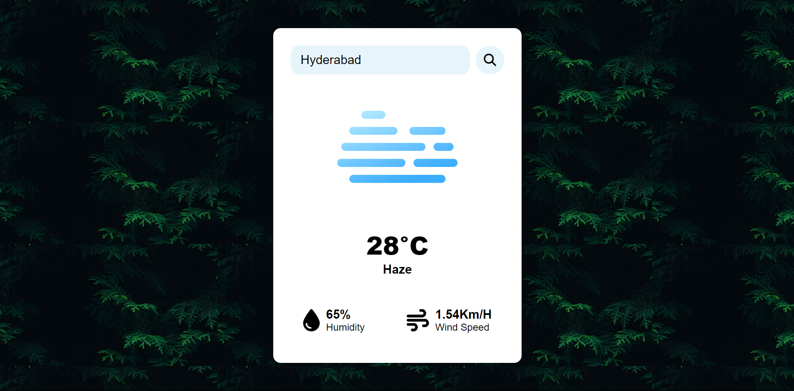

# Weather-App
This weather application makes use of a weather API to retrieve and display real-time weather data for cities worldwide. Users can search for any location, and the app presents the current temperature, weather conditions (e.g., clear skies, rain), humidity level, and wind speed.

Access the website at: 

# Features
* Global city search: Enter any city name to retrieve its current weather data.
* Current weather conditions: Get a clear picture of what's happening outside, including sky description (e.g., clear, cloudy, rainy).
* Temperature display: View the current temperature in Celsius.
* Humidity level: Stay aware of humidity levels for comfort and potential health concerns.
* Wind speed: Plan your activities by knowing wind speed.
